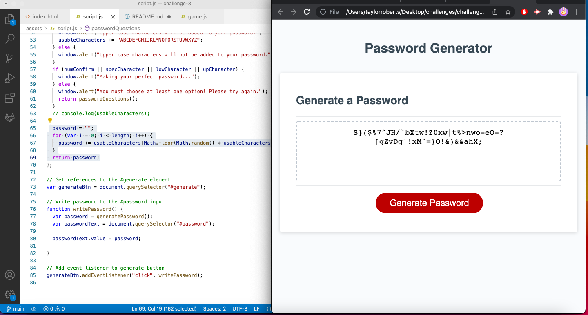

# Password Generator

## Motivation

- My motivation for creating this page was to be able to create a randomly generated password with characters of my choosing and a length of my choosing between 8 to 128 characters. This would allow for a more secure and difficult to guess password without having to think of a random one myself.

## Problems

- This being my first JavaScript project made the creation of the generator pretty slow-going. By referencing some code from previous projects, however, I was able to infer what the appropriate next steps would be when making the prompts for the character inclusion questions. My biggest issue came when I was attempting to generate the actual password based on user input. I contemplated and attempted a lot of methods that seemed to clutter my code and make it difficult to read. In the end I decided to make an empty usableCharacters variable and used += under each if statement to add the correlating string of characters chosen by the user. I then used this variable in Math.random with the length the user chose in the beginning of the prompt sequence.

## What I Learned 

- Trying and failing many times to build the code to generate the actual password had me exploring many new JavaScript functions that ultimately didn't work for my code, but gave me knowledge for possible future use.

## What Makes this Project Stand Out

- It serves it's intended purpose

### Click [here](https://taystarr.github.io/password-generator/) to view my password generator!